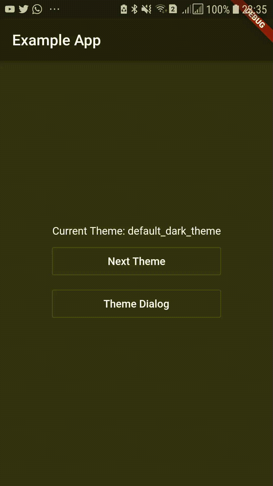
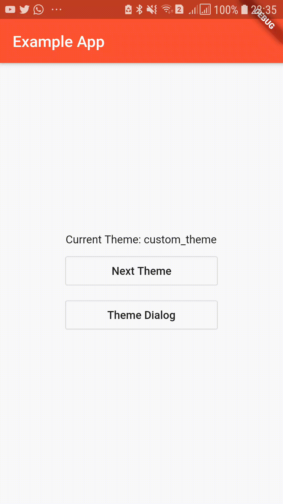

# theme_provider

Easy to use, customizable Theme Provider. This provides app color schemes throughout the app and automatically rebuilds the UI dynamically.
You can also persist your color theme as well. Easily store and retrieve user preference without hassle.
This package also provides you with several widgets that can help you to easily add theme switching abilities.
Additionally you can pass option classes to store and provide data which should be associated with the current theme.

[](https://codemagic.io/apps/5cfb60390824820019d5af6b/5cfb60390824820019d5af6a/latest_build) [](https://pub.dartlang.org/packages/theme_provider)

## ▶️ Basic Demonstration

**Web demo is available in [https://kdsuneraavinash.github.io/theme_provider](https://kdsuneraavinash.github.io/theme_provider)**

| Basic Usage           | Dialog Box           |
|:-------------:|:-------------:|
|  |  |

## 💻 Include in your project

```yaml
dependencies:
  theme_provider: <latest version>
```

run packages get and import it

```dart
import 'package:theme_provider/theme_provider.dart';
```

## 👨‍💻 Usage

### Basic Usage

Wrap your material app like this to use dark theme and light theme out of the box.

```dart
class MyApp extends StatelessWidget {
  @override
  Widget build(BuildContext context) {
    return ThemeProvider(
      child: MaterialApp(
        home: ThemeConsumer(
          child: HomePage(),
        ),
      ),
    );
  }
}
```

### Provide additional themes

You may also provide additional themes using the `themes` parameter. Here you have to provide a theme id string and theme data value. (Make sure to provide unique theme ids)

```dart
class MyApp extends StatelessWidget {
  @override
  Widget build(BuildContext context) {
    return ThemeProvider(
      themes: [
        AppTheme.light(), // This is standard light theme (id is default_light_theme)
        AppTheme.dark(), // This is standard dark theme (id is default_dark_theme)
        AppTheme(
          id: "custom_theme", // Id(or name) of the theme(Has to be unique)
          data: ThemeData(  // Real theme data
            primaryColor: Colors.black,
            accentColor: Colors.red,
          ),
        ),
      ],
      child: MaterialApp(
        home: ThemeConsumer(
          child: HomePage(),
        ),
      ),
    );
  }
}
```

### Changing and accessing the current theme

You can use the theme id strings to change the current theme of the app.

```dart
 ThemeProvider.controllerOf(context).nextTheme();
 // Or
 ThemeProvider.controllerOf(context).setTheme(THEME_ID);
```

Access current `AppTheme`

```dart
 ThemeProvider.themeOf(context)
```

Access theme data:

```dart
 ThemeProvider.themeOf(context).data
 // or
 Theme.of(context)
```

### Apps with routing

**Wrap each route and dialog in `ThemeConsumer`.**

```dart
MaterialPageRoute(
  builder: (_) => ThemeConsumer(child: SecondPage()),
),
```

**Or you may wrap `MaterialApp` with `ThemeConsumer`.**
If you provide the theme consumer on `MaterialTheme` then you don't have to provide `ThemeConsumer` on routes. However that would disable the ability to use multiple theme controllers. Also a visible flickr may occur at the start of app when the saved theme is loaded.

```dart
ThemeProvider(
    child: ThemeConsumer(
        child: MaterialApp(
            home: HomePage(),
        ),
    ),
)
```

### Provide callbacks for theme changing event

If you want to change the `StatusBarColor` when the theme changes, you can provide a `onThemeChanged` callback to the `ThemeProvider`.

### Passing Additional Options

This can also be used to pass additional data associated with the theme. Use `options` to pass additional data that should be associated with the theme.
eg: If font color on a specific button changes according to the current theme, create a class to encapsulate the value.

Options classes must implement or extend `AppThemeOptions`.

```dart
  class MyThemeOptions implements AppThemeOptions{
    final Color specificButtonColor;
    MyThemeOptions(this.specificButtonColor);
  }
```

Then provide the options with the theme.

```dart
class MyApp extends StatelessWidget {
  @override
  Widget build(BuildContext context) {
    return ThemeProvider(
      themes: [
        AppTheme(
          id: "light_theme",
          data: ThemeData.light(),
          options: MyThemeOptions(Colors.blue),
        ),
        AppTheme(
          id: "light_theme",
          data: ThemeData.dark(),
          options: MyThemeOptions(Colors.red),
        ),
      ],
      child: MaterialApp(
        home: ThemeConsumer(
          child: HomePage(),
        ),
      ),
    );
  }
}
```

Then the option can be retrieved as,

```dart
ThemeProvider.optionsOf<MyThemeOptions>(context).specificButtonColor
```

## 💾 Persisting theme

### Saving theme

To persist themes, simply pass `saveThemesOnChange` as `true`.
This will ensure that the theme is saved to the disk.

```dart
class MyApp extends StatelessWidget {
  @override
  Widget build(BuildContext context) {
    return ThemeProvider(
      saveThemesOnChange: true,
       child: MaterialApp(
        home: ThemeConsumer(
          child: HomePage(),
        ),
      ),
    );
  }
}
```

Or manually save the current theme by just using,

```dart
ThemeProvider.controllerOf(context).saveThemeToDisk();
```

### Loading saved theme

`defaultThemeId` will always be used to determine the initial theme. (If not provided the first theme you specify will be the default app theme.)
But you can manually load the previous(saved) theme by using:

```dart
 ThemeProvider.controllerOf(context).loadThemeFromDisk();
```

To load a previously saved theme pass `loadThemeOnInit` as true:

```dart
ThemeProvider(
  child: MaterialApp(
    home: ThemeConsumer(
      child: HomePage(),
    ),
  ),
  saveThemesOnChange: true,
  loadThemeOnInit: true,
)
```

Or to load a theme/do some task at theme controller initialization use `onInitCallback`.
This will get called on the start.

For example, snippet below will load the previously saved theme from the disk. (if previosuly saved.)

```dart
ThemeProvider(
  child: MaterialApp(
      home: ThemeConsumer(
        child: HomePage(),
      ),
    ),
  defaultThemeId: "theme_1",
  themes: [
    AppTheme.light(id: "theme_1"),
    AppTheme.light(id: "theme_2"),
    AppTheme.light(id: "theme_3"),
  ],
  saveThemesOnChange: true,
  onInitCallback: (controller, previouslySavedThemeFuture) async {
    // Do some other task here if you need to
    String savedTheme = await previouslySavedThemeFuture;
    if (savedTheme != null) {
      controller.setTheme(savedTheme);
    }
  },
)
```

## 🎁 Additional Widgets

### Theme Cycle Widget

`IconButton` to be added to `AppBar` to cycle to next theme.

```dart
Scaffold(
  appBar: AppBar(
    title: Text("Example App"),
    actions: [CycleThemeIconButton()]
  ),
),
```

### Theme Selecting Dialog

`SimpleDialog` to let the user select the theme.
Many elements in this dialog is customizable.
*Remember to wrap dialog is a `ThemeConsumer`.*

```dart
showDialog(context: context, builder: (_) => ThemeConsumer(child: ThemeDialog()))
```

## ☑️ TODO

- [x] Add next theme command
- [x] Add theme cycling widget
- [x] Add theme selection by theme id
- [x] Add theme select and preview widget
- [x] Persist current selected theme
- [x] Add unit tests and example
- [x] Remove provider dependency
- [x] Ids for theme_providers to allow multiple theme providers
- [x] Add example to demostrate persistence

## 🐞 Bugs/Requests

If you encounter any problems feel free to open an issue.
Pull request are also welcome.
