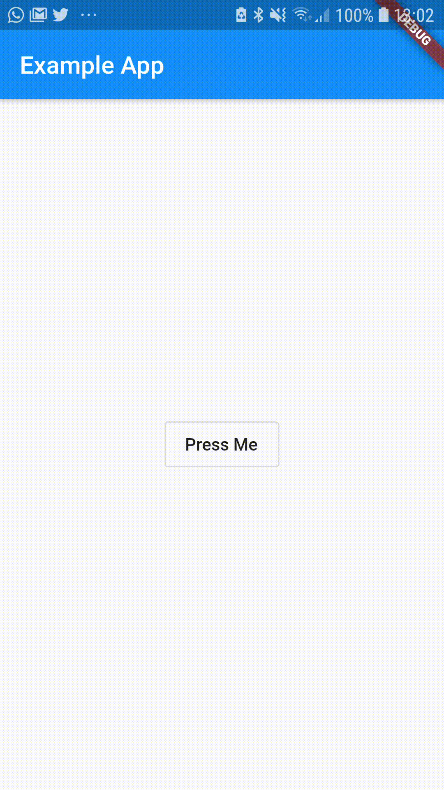

# theme_provider

[](https://codemagic.io/apps/5cfb60390824820019d5af6b/5cfb60390824820019d5af6a/latest_build)
[](https://pub.dartlang.org/packages/theme_provider)

Easy to use, customizable and pluggable Theme Provider.
**This is still a work in progress.**

| Basic Usage           |
|:-------------:|
|  |

## Include in your project

```yaml
dependencies:
  theme_provider: ^0.0.1
```

run packages get and import it

```dart
import 'package:theme_provider/theme_provider.dart';
```

## Usage

Wrap your material app like this:

```dart
class MyApp extends StatelessWidget {
  @override
  Widget build(BuildContext context) {
    return ThemeProvider(
      builder: (context, theme) => MaterialApp(
        home: HomePage(),
        theme: theme,
      ),
    );
  }
}
```

To change the theme:

```dart
 ThemeProvider.controllerOf(context).nextTheme();
```

Access theme data:

```dart
 ThemeProvider.themeOf(context)
 // or
 Theme.of(context)
```

### Passing Additional Options

This can also be used to pass additional data associated with the theme. Use `options` to pass additional data that should be associated with the theme.
eg: If font color on a specific button changes create a class to encapsulate the value.

```dart
  class ThemeOptions{
    final Color specificButtonColor;
    ThemeOptions(this.specificButtonColor);
  }
```

  Then provide the options with the theme.

  ```dart
class MyApp extends StatelessWidget {
  @override
  Widget build(BuildContext context) {
    return ThemeProvider(
      themes: themes: [
          AppTheme<ThemeOptions>(
              data: ThemeData.light(),
              options: ThemeOptions(Colors.blue),
          ),
          AppTheme<ThemeOptions>(
              data: ThemeData.dark(),
              options: ThemeOptions(Colors.red),
          ),
        ],
        builder: (context, theme) => MaterialApp(
          home: HomePage(),
          theme: theme,
        ),
    );
  }
}
  ```

Then the option can be retrieved as,

```dart
ThemeProvider.optionsOf<ThemeOptions>(context).specificButtonColor
```

## TODO

- [x] Add next theme command
- [x] Add theme cycling widget
- [x] Add theme selection by theme id
- [ ] Add theme select and preview widget
- [ ] Persist current selected theme
- [x] Add unit tests and example
- [x] Remove provider dependency

## API Plan

This is what the API is supposed to look like after publishing.

```dart
import 'package:flutter/material.dart';

class DataOptions{
final Color textColorOnPrimaryColor;
  final Color textColorOnAccentColor;

  DataOptions({this.textColorOnPrimaryColor, this.textColorOnAccentColor});
}


class MyApp extends StatelessWidget{
  @override
  Widget build(BuildContext context){
    return ThemeProvider(
      loadFromDeviceIfPossible: true,
      saveThemeChangesToDevice: true,
      defaultThemeId: "dark_theme",
      themeSwitchErrorHandler: ThemeSwitchErrorHandler.SILENTLY_DEFAULT,
      themes: [
        AppTheme<DataOptions>.pinkAppTheme(
          options: DataOptions(
              textColorOnPrimaryColor: Colors.black,
              textColorOnAccentColor: Colors.black,
            ),
          ),
        AppTheme<DataOptions>(
          id: "dark_theme",
          description: "Dark theme - white combined with black",
          data: ThemeData(
              primaryColor: Colors.black,
              accentColor: Colors.white,
              brightness: Brightness.dark,
            ),
          options: DataOptions(
              textColorOnPrimaryColor: Colors.white,
              textColorOnAccentColor: Colors.black,
            ),
        ),
        AppTheme<DataOptions>(
          id: "light_theme",
          description: "Light theme - only white",
          data: ThemeData(
              primaryColor: Colors.white,
              accentColor: Colors.white,
              brightness: Brightness.dark,
            ),
          options: DataOptions(
              textColorOnPrimaryColor: Colors.black,
              textColorOnAccentColor: Colors.black,
            ),
        ),
      ],
      builder: (theme) => MaterialApp(
        theme: theme,
        home: HomePage(),
      ),
    );
  }
}


class HomePage extends StatelessWidget{
  @override
  Widget build(BuildContext context){
    return Scaffold(
        appBar: AppBar(title: Text("Example"), actions: CycleThemeIconButton()),
        body: Builder(
          builder: (context) => Center(
            child: FlatButton(
              child: Text("Press ME",
                  style: TextStyle(color: ThemeProvider.optionsOf(context).textColorOnAccentColor)
                ),
              onPressed(){
                ThemeProvider.controllerOf(context).nextTheme();
                ThemeProvider.controllerOf(context).prevTheme();

                if (ThemeProvider.controllerOf(context).currentTheme == 'light_theme'){
                  ThemeProvider.controllerOf(context).setTheme('dark_theme');
                }

                showDialog(context: context, ThemeSelectorDialog());
              }
            ),
          ),
        ),
      );
  }
}
```

## Getting Started

For help getting started with Flutter, view our online [documentation](https://flutter.io/).

For help on editing package code, view the [documentation](https://flutter.io/developing-packages/).
